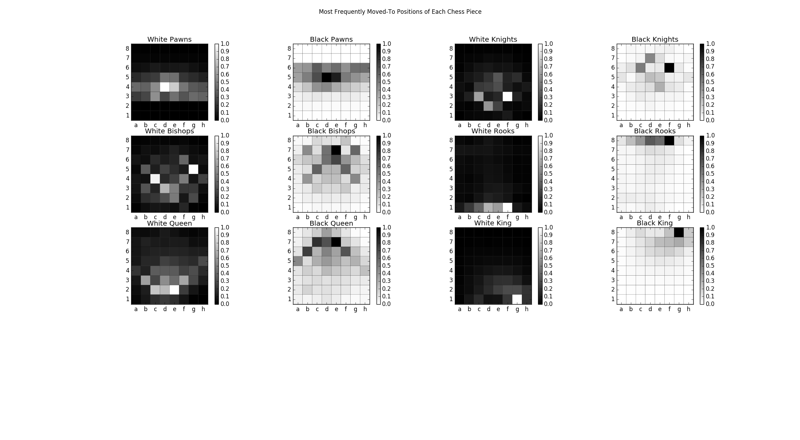

# Move Frequency Analysis for ~300k Chess Games

Originally obtained data in the form of portable game notation (PGN)  
sample:
```
[Event "BL2-S9596"]
[Site "Germany"]
[Date "1996.??.??"]
[Round "?"]
[White "Gerstner, Wolfgang"]
[Black "Fahnenschmidt, Gerhard"]
[Result "1-0"]
[WhiteElo "2385"]
[BlackElo "2400"]
[ECO "A46"]

1. d4 Nf6 2. Bg5 e6 3. Nd2 c5 4. e3 b6 5. c3 Bb7 6. Ngf3 Be7 7. Bd3 h6 8. 
Bh4 cxd4 9. exd4 O-O 10. O-O Ba6 11. Bxa6 Nxa6 12. Ne5 Nd5 13. Bxe7 Nxe7 
14. Qe2 Nb8 15. a4 Nbc6 16. Nxc6 Nxc6 17. d5 exd5 18. Nf3 Qf6 19. Rad1 
Rfe8 20. Qb5 Re4 21. Rxd5 Rae8 22. Rxd7 Rg4 23. h3 Rg6 24. Nd4 Nxd4 25. 
Rxd4 Re5 26. Qd3 Qc6 27. g3 Qe6 28. Kg2 Re2 29. b3 Qc6+ 30. Kg1 Rb2 31. c4
Qc5 32. h4 Qh5 33. Re1 Kh7 34. Rd5 f5 35. Rxf5 Qxh4 36. Rf8 Qg5 37. Ree8 
Qc1+ 38. Kg2 Rxf2+ 39. Kxf2 Qb2+ 40. Kf3 1-0
```

Final Results:
  
  
  
A note: if you know a little about chess and are wondering how castling was counted; I counted it was a move by both the King and Rook to their respective positions. This is why the most frequent moves for the white king and black king are to g1 and g8, respectively. Similarly, you can see the most activity for rooks occurs on the initial castling square and then fades out as they occupy the center files throughout the game.
